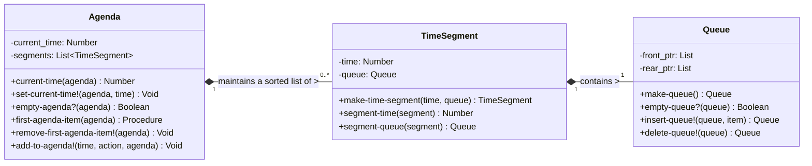

```mermaid 
classDiagram
    direction LR
    class Agenda {
        -current_time: Number
        -segments: List~TimeSegment~
        +current-time(agenda) Number
        +set-current-time!(agenda, time) Void
        +empty-agenda?(agenda) Boolean
        +first-agenda-item(agenda) Procedure
        +remove-first-agenda-item!(agenda) Void
        +add-to-agenda!(time, action, agenda) Void
    }

    class TimeSegment {
        -time: Number
        -queue: Queue
        +make-time-segment(time, queue) TimeSegment
        +segment-time(segment) Number
        +segment-queue(segment) Queue
    }

    class Queue {
        -front_ptr: List
        -rear_ptr: List
        +make-queue() Queue
        +empty-queue?(queue) Boolean
        +insert-queue!(queue, item) Queue
        +delete-queue!(queue) Queue
    }

    Agenda "1" *-- "0..*" TimeSegment : maintains a sorted list of >
    TimeSegment "1" *-- "1" Queue : contains >

```

![[Circuit_Sim_UML_Flow_chart.png]]
![[Example_agenda_struct.png]]
